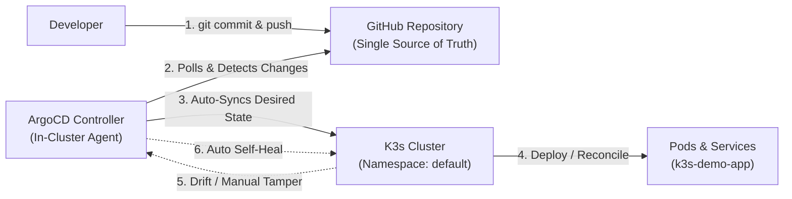

# GitOps Workflow using ArgoCD on K3s Kubernetes

A declarative, GitOps-driven continuous delivery pipeline implemented on a lightweight Kubernetes cluster (**K3s**) using **ArgoCD**, **GitHub**, and **Docker**.

---

## 📌 Project Overview

This project establishes **Git as the Single Source of Truth** for Kubernetes infrastructure and application state. Any configuration change pushed to the Git repository is automatically detected, reconciled, and deployed to the Kubernetes cluster by ArgoCD without requiring manual `kubectl` intervention.

### Key Highlights
- **Declarative Continuous Delivery:** Infrastructure and deployment manifests are versioned in Git.
- **Automated Synchronization:** Automatic polling and webhook-driven updates from Git to the live cluster.
- **Self-Healing & Drift Detection:** Automatic remediation of unauthorized out-of-band manual changes made directly to the cluster.
- **Production-Ready Resource Governance:** Configured container resource requests and limits to mitigate the "Noisy Neighbor" problem and enforce Kubernetes `Burstable` Quality of Service (QoS).

---

## 🏗️ Architecture & GitOps Workflow



---

## 🧰 Tech Stack & Tools

| Tool | Purpose |
|---|---|
| **K3s** | Lightweight, production-ready Kubernetes distribution |
| **ArgoCD** | Declarative GitOps continuous delivery tool for Kubernetes |
| **GitHub** | Version control system & GitOps source of truth |
| **kubectl** | Kubernetes CLI for cluster administration |
| **Docker / NGINX** | Containerized sample application |
| **WSL2 / Linux** | Local development and orchestration environment |

---

## 📂 Repository Structure

```text
.
├── k8s/
│   ├── deployment.yaml   # Nginx Deployment with resource limits (Noisy Neighbor fix)
│   └── service.yaml      # ClusterIP service definition
├── devops projects.pdf   # Internship project requirements & guidelines
└── README.md             # Project documentation
```

---

## 🚀 Step-by-Step Implementation Guide

### 1. Verify K3s Cluster
Ensure your K3s cluster is active and configure `kubectl` access:
```bash
sudo systemctl status k3s
kubectl get nodes
```

### 2. Install ArgoCD
Create the dedicated `argocd` namespace and apply the official installation manifests:
```bash
kubectl create namespace argocd
kubectl apply -n argocd -f https://raw.githubusercontent.com/argoproj/argo-cd/stable/manifests/install.yaml
```

Verify that all ArgoCD pods are running:
```bash
kubectl get pods -n argocd
```

### 3. Expose & Access ArgoCD UI
To access the ArgoCD web console from Windows/WSL2, port-forward the service:
```bash
kubectl port-forward svc/argocd-server -n argocd 8080:443 --address 0.0.0.0
```

* **URL:** [https://localhost:8080](https://localhost:8080) *(Accept the self-signed certificate)*
* **Username:** `admin`
* **Retrieve Password (Linux / WSL):**
  ```bash
  kubectl -n argocd get secret argocd-initial-admin-secret -o jsonpath="{.data.password}" | base64 -d; echo
  ```
* **Retrieve Password (Windows PowerShell):**
  ```powershell
  [System.Text.Encoding]::UTF8.GetString([System.Convert]::FromBase64String((kubectl -n argocd get secret argocd-initial-admin-secret -o jsonpath="{.data.password}")))
  ```

---

### 4. Kubernetes Manifests Configuration

#### Deployment (`k8s/deployment.yaml`)
Includes **CPU and memory requests & limits** to eliminate the **Noisy Neighbor** issue and ensure pod stability:
```yaml
apiVersion: apps/v1
kind: Deployment
metadata:
  name: k3s-demo-app
  namespace: default
  labels:
    app: k3s-demo
spec:
  replicas: 2
  selector:
    matchLabels:
      app: k3s-demo
  template:
    metadata:
      labels:
        app: k3s-demo
    spec:
      containers:
      - name: web
        image: nginx:alpine
        ports:
        - containerPort: 80
        resources:
          requests:
            memory: "64Mi"
            cpu: "50m"
          limits:
            memory: "128Mi"
            cpu: "200m"
```

#### Service (`k8s/service.yaml`)
```yaml
apiVersion: v1
kind: Service
metadata:
  name: k3s-demo-service
  namespace: default
spec:
  type: ClusterIP
  selector:
    app: k3s-demo
  ports:
    - port: 80
      targetPort: 80
```

---

### 5. Configure ArgoCD Application

You can register the application via the **ArgoCD Web UI** or via a declarative manifest:

#### Option A: Web UI
1. Click **+ NEW APP** in the ArgoCD console.
2. Configure settings:
   - **Application Name:** `k3s-demo-app`
   - **Project:** `default`
   - **Sync Policy:** `Automatic` (Enable **Prune Resources** and **Self Heal**)
   - **Repository URL:** `<YOUR_GITHUB_REPO_URL>`
   - **Revision:** `main` (or `HEAD`)
   - **Path:** `k8s`
   - **Cluster URL:** `https://kubernetes.default.svc`
   - **Namespace:** `default`
3. Click **CREATE**.

#### Option B: Declarative Manifest (`application.yaml`)
```yaml
apiVersion: argoproj.io/v1alpha1
kind: Application
metadata:
  name: k3s-demo-app
  namespace: argocd
spec:
  project: default
  source:
    repoURL: '<YOUR_GITHUB_REPO_URL>'
    targetRevision: HEAD
    path: k8s
  destination:
    server: 'https://kubernetes.default.svc'
    namespace: default
  syncPolicy:
    automated:
      prune: true
      selfHeal: true
```
Apply with:
```bash
kubectl apply -f application.yaml
```

---

## 🧪 Validating GitOps Capabilities

### 1. Initial State Verification
Verify the application is synchronized and healthy:
```bash
kubectl get pods -l app=k3s-demo
kubectl get svc k3s-demo-service
```
ArgoCD UI should display both tiles as **Healthy** and **Synced**.

### 2. Automated Git-Triggered Deployment
1. Edit `k8s/deployment.yaml` in your Git repository.
2. Change `replicas: 2` to `replicas: 4`.
3. Commit and push:
   ```bash
   git add k8s/deployment.yaml
   git commit -m "Scale replicas from 2 to 4"
   git push origin main
   ```
4. Within seconds, ArgoCD reconciles the cluster state to match Git. Verify 4 pods running:
   ```bash
   kubectl get pods -l app=k3s-demo
   ```

### 3. Self-Healing & Drift Remediation
1. Simulate cluster drift by manually modifying live resources using `kubectl`:
   ```bash
   kubectl scale deployment k3s-demo-app --replicas=1
   ```
2. ArgoCD detects the discrepancy against Git, marks the resource as `OutOfSync`, and immediately scales the deployment back to `4` replicas according to the Git definition.

---

## 🛡️ Best Practices Applied

1. **Git as Single Source of Truth:** Cluster state changes can only originate from peer-reviewed Git commits.
2. **Resource Requests & Limits:** Avoids CPU starvation and out-of-memory (OOM) kills on the shared K3s node, securing a `Burstable` QoS tier.
3. **Automated Pruning:** Any resource deleted from the Git repository is automatically removed from Kubernetes, preventing orphaned resources.
4. **Automated Drift Correction:** Reverts manual operational mistakes or unauthorized changes in real time.
