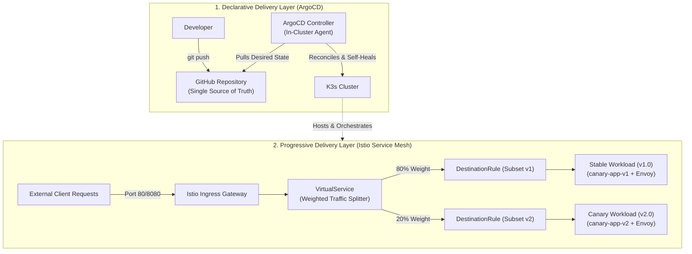

# 🌐 Cloud-Native DevOps & Kubernetes Portfolio

[](https://k3s.io/)
[](https://istio.io/)
[](https://argoproj.github.io/cd/)
[](https://helm.sh/)
[](https://podman.io/)
[](https://www.python.org/)

A production-ready portfolio demonstrating **advanced Kubernetes orchestration**, **declarative continuous delivery (GitOps)**, and **progressive traffic management** on lightweight K3s clusters.

This repository integrates two end-to-end DevOps projects:
1. **Canary Deployments with Istio Service Mesh** — Dynamic Layer 7 traffic shifting, zero-downtime releases, and sub-second rollbacks.
2. **GitOps Continuous Delivery with ArgoCD** — Git-as-a-single-source-of-truth, automated synchronization, drift detection, and self-healing infrastructure.

---

## 📑 Projects Matrix

| Project | Focus Area | Core Stack | Key Outcomes | Directory Link |
| :--- | :--- | :--- | :--- | :--- |
| **1. Canary Deployment with Istio** | Progressive Delivery & L7 Traffic Management | K3s, Istio Service Mesh, Helm, Podman, Python/Flask | • 80/20 probabilistic traffic splitting<br>• Decoupled deployment from release<br>• Sub-second rollback via Envoy routing rules | [Explore Project 1](./Kubernetes-Based%20Canary%20Deployment%20with%20K3s%20and%20Istio/) |
| **2. GitOps Workflow with ArgoCD** | Declarative Continuous Delivery & Self-Healing | K3s, ArgoCD, GitHub, Docker/NGINX, kubectl | • 100% declarative cluster synchronization<br>• Automatic drift detection & self-healing<br>• Pod resource governance & Burstable QoS | [Explore Project 2](./GitOps%20Workflow%20using%20ArgoCD%20on%20Kubernetes/) |

---

## 🏛️ End-to-End Enterprise Architecture

Together, both projects demonstrate an enterprise-grade cloud-native deployment lifecycle: **ArgoCD** reconciles infrastructure and workload state declaratively from Git, while **Istio** handles intelligent run-time routing, isolating blast radius during application upgrades.



---

## 📂 Repository Layout

```text
.
├── GitOps Workflow using ArgoCD on Kubernetes/
│   ├── k8s/
│   │   ├── deployment.yaml            # Nginx Deployment with CPU/Memory requests & limits
│   │   └── service.yaml               # ClusterIP Service manifest
│   ├── devops projects.pdf            # Project specifications & guidelines
│   └── README.md                      # Comprehensive GitOps guide & walkthrough
│
├── Kubernetes-Based Canary Deployment with K3s and Istio/
│   ├── app.py                         # Python/Flask microservice with version-aware endpoints
│   ├── Dockerfile                     # Multi-stage container build definition
│   ├── pyproject.toml                 # Application dependencies & metadata
│   ├── app-deployments.yaml           # Dual Deployments (v1 & v2) + unified Service
│   ├── istio-routing.yaml             # Gateway, DestinationRule, and VirtualService (80/20)
│   └── README.md                      # Comprehensive Canary Deployment walkthrough
│
└── README.md                          # Root portfolio documentation
```

---

## 📦 Project 1: Kubernetes-Based Canary Deployment with K3s and Istio

### Overview
Demonstrates **Progressive Delivery** by routing external user traffic probabilistically between a stable release (`v1.0`) and a new canary candidate (`v2.0`) using Istio Service Mesh on K3s, independent of pod replica counts.

### Key Capabilities
- **Probabilistic Traffic Splitting:** Configured an Istio `VirtualService` for an **80/20 traffic weight** between subsets without altering replica distribution.
- **Sidecar Proxy Injection:** Leveraged automatic Envoy proxy injection (`istio-injection=enabled`) for transparent L7 traffic routing and telemetry.
- **Sub-Second Rollback:** Rollback executed in milliseconds by setting canary traffic weight to `0%`—without deleting pods or pulling older container images.
- **Automated Validation:** Verified traffic distribution using automated PowerShell loops querying the Ingress Gateway.

### Quick Start
```powershell
# 1. Navigate to the project directory
cd "Kubernetes-Based Canary Deployment with K3s and Istio"

# 2. Deploy workloads and routing rules
kubectl apply -f app-deployments.yaml
kubectl apply -f istio-routing.yaml

# 3. Port-forward Ingress Gateway and run validation loop
Start-Job -Name "k8s-tunnel" -ScriptBlock { kubectl port-forward svc/istio-ingress -n istio-system 8080:80 }
1..50 | ForEach-Object { (Invoke-RestMethod -Uri "http://localhost:8080").message }
```

📖 **Full Documentation:** [Read the Canary Deployment Guide](./Kubernetes-Based%20Canary%20Deployment%20with%20K3s%20and%20Istio/README.md)

---

## 📦 Project 2: GitOps Workflow using ArgoCD on Kubernetes

### Overview
Implements a declarative **GitOps continuous delivery model** where the Git repository serves as the single source of truth for the entire cluster state. ArgoCD continuously monitors, reconciles, and self-heals Kubernetes resources against the defined Git manifests.

### Key Capabilities
- **Declarative Continuous Delivery:** Changes committed to Git automatically trigger cluster reconciliation without manual `kubectl` intervention.
- **Drift Remediation & Self-Healing:** Unauthorized manual cluster edits (e.g., ad-hoc `kubectl scale`) are instantly flagged as `OutOfSync` and automatically reverted.
- **Automated Resource Pruning:** Obsolete resources deleted from Git are safely purged from the cluster, preventing configuration drift and orphan resources.
- **Noisy Neighbor Mitigation:** Configured production-grade container resource `requests` and `limits` to enforce Kubernetes `Burstable` Quality of Service (QoS).

### Quick Start
```bash
# 1. Navigate to the project directory
cd "GitOps Workflow using ArgoCD on Kubernetes"

# 2. Install ArgoCD on K3s
kubectl create namespace argocd
kubectl apply -n argocd -f https://raw.githubusercontent.com/argoproj/argo-cd/stable/manifests/install.yaml

# 3. Access ArgoCD Console
kubectl port-forward svc/argocd-server -n argocd 8080:443 --address 0.0.0.0
# Access via https://localhost:8080 (User: admin)
```

📖 **Full Documentation:** [Read the GitOps Workflow Guide](./GitOps%20Workflow%20using%20ArgoCD%20on%20Kubernetes/README.md)

---

## 🛡️ Best Practices & Production Standards Applied

1. **Git as Single Source of Truth:** Cluster states strictly match version-controlled Git commits, ensuring reproducibility and an immutable audit log.
2. **Layer 7 Over Layer 4 Routing:** Standard Kubernetes rolling updates rely on replica ratios (L4 round-robin). Istio decouples traffic volume from pod counts, enabling micro-rollouts (e.g., 99% / 1%).
3. **Cluster Stability & QoS:** Explicit resource requests and limits prevent resource starvation, memory leaks, and OOM kills on multi-tenant nodes.
4. **Resilience & Self-Healing:** Automated reconciliation eliminates configuration drift from manual changes or human error in production environments.
5. **Decoupled Deployment from Release:** New code versions are deployed, health-checked, and validated with sidecars before any live user traffic is exposed.

---

## ⚙️ Prerequisites & Environment Setup

- **Kubernetes Engine:** [K3s](https://k3s.io/) (via Rancher Desktop or native Linux/WSL2)
- **Service Mesh:** [Istio](https://istio.io/) v1.25+ installed via [Helm v3](https://helm.sh/)
- **GitOps Agent:** [ArgoCD](https://argo-cd.readthedocs.io/) v2.8+
- **Container Runtime / CLI:** [Podman](https://podman.io/) v6.1+ or Docker Engine
- **Language Runtimes:** Python 3.11, PowerShell 7 / Bash
